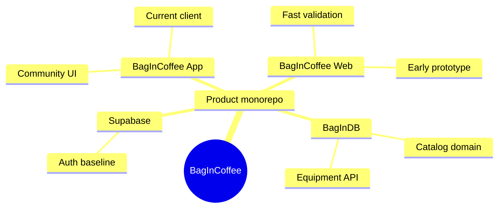

<div class="hub-header">
  <p class="hub-kicker">프로젝트 / 커피 커뮤니티</p>
  <h2>목표</h2>
  <p class="hub-lede">
    처음에는 커피 커뮤니티를 빠르게 검증하는 것이 목표였지만, 실제로 제품을 확장하려고 하자 웹 중심 구조와 단일 백엔드만으로는 한계가 분명해졌습니다. BagInCoffee는 기능 구현뿐 아니라, 어떤 시점에 클라이언트와 도메인 구조를 다시 나눠야 하는지를 보여주는 프로젝트입니다.
  </p>
</div>

<section class="hub-section">
  <p class="hub-section-kicker">실행</p>
  <h3>실행 화면</h3>
  <div class="hub-proof-grid">
    <div class="hub-proof-card">
      <div class="hub-proof-media">
        
      </div>
      <span class="hub-label">웹 프로토타입</span>
      <strong>웹 프로토타입으로 커뮤니티 핵심 흐름을 먼저 검증했기 때문에 무엇을 유지하고 무엇을 버릴지 결정할 수 있었습니다</strong>
      <p>초기 웹 피드와 콘텐츠 흐름이 있었기 때문에, 제품의 핵심 경험은 살리고 클라이언트 기술만 다시 선택하는 판단이 가능했습니다.</p>
    </div>
    <div class="hub-proof-card">
      <div class="hub-proof-media">
        
      </div>
      <span class="hub-label">Flutter 전환</span>
      <strong>Flutter 전환은 단순 재구현이 아니라 웹과 모바일 경험을 하나의 코드베이스로 묶기 위한 판단이었습니다</strong>
      <p>모바일 메인 화면까지 실제로 이어졌기 때문에, SvelteKit에서 Flutter로의 이동이 선언이 아니라 동작 가능한 제품 방향임을 보여줄 수 있습니다.</p>
    </div>
    <div class="hub-proof-card">
      <div class="hub-proof-media">
        
      </div>
      <span class="hub-label">도메인 분리</span>
      <strong>브랜드와 장비 탐색 화면이 커질수록 커뮤니티 백엔드와 다른 도메인 리듬이 드러나 BagInDB 분리가 필요해졌습니다</strong>
      <p>브랜드, 카테고리, 제품 스펙 탐색은 커뮤니티 피드와 요구사항이 달랐기 때문에, 별도 장비 API로 나눌 이유를 실제 UI와 데이터 흐름으로 설명할 수 있습니다.</p>
    </div>
    <div class="hub-proof-card">
      <span class="hub-label">검증 범위</span>
      <strong>브랜드 67개, 카테고리 34개, 제품 62개, 3개 언어 지원과 캐시 적중률 85% 이상 목표까지 구조를 확장했습니다</strong>
      <p>이 프로젝트는 화면만 만든 수준이 아니라 제품 데이터와 장비 API를 함께 키워가며, 클라이언트 전환과 도메인 분리가 실제로 필요한 순간을 검증한 사례입니다.</p>
    </div>
  </div>
</section>

<section class="hub-section">
  <p class="hub-section-kicker">배경</p>
  <h3>배경</h3>
  <ul class="hub-list">
    <li class="hub-item">
      <div class="hub-note">
        <span class="hub-label">문제</span>
        <p>커뮤니티, 가이드, 브루잉 기록, 장비 탐색을 하나의 제품 경험으로 묶고 싶었지만, 웹 프로토타입만으로는 실제 사용성을 충분히 검증하기 어려웠습니다.</p>
      </div>
    </li>
    <li class="hub-item">
      <div class="hub-note">
        <span class="hub-label">전환</span>
        <p>그래서 BagInCoffee는 단순 웹 서비스가 아니라, 제품을 만들면서 어떤 클라이언트가 맞는지, 어떤 데이터는 별도 서비스로 분리해야 하는지를 검증하는 프로젝트로 바뀌었습니다.</p>
      </div>
    </li>
    <li class="hub-item">
      <div class="hub-note">
        <span class="hub-label">범위</span>
        <p>1인 개발로 제품 방향, UI 설계, 프론트엔드, 백엔드, 데이터 모델링, 아키텍처 분리를 직접 진행했고, 현재는 제품 실험과 구조 검증을 마친 상태입니다.</p>
      </div>
    </li>
  </ul>
</section>

<section class="hub-section">
  <p class="hub-section-kicker">판단</p>
  <h3>판단</h3>
  <ul class="hub-list">
    <li class="hub-item">
      <div class="hub-note">
        <span class="hub-label">판단 1</span>
        <p>SvelteKit에서 Flutter로 전환했습니다. 빠른 웹 검증에는 SvelteKit이 유리했지만, 웹과 모바일을 함께 가져가려면 Flutter가 더 일관된 사용자 경험을 만들 수 있다고 판단했기 때문입니다.</p>
      </div>
    </li>
    <li class="hub-item">
      <div class="hub-note">
        <span class="hub-label">판단 2</span>
        <p>장비, 브랜드, 제품 스펙 영역은 BagInDB로 분리했습니다. 커뮤니티 데이터와 장비 데이터는 요구사항이 달라 하나의 백엔드에 계속 쌓는 편이 오히려 유지보수에 불리하다고 봤기 때문입니다.</p>
      </div>
    </li>
    <li class="hub-item">
      <div class="hub-note">
        <span class="hub-label">판단 3</span>
        <p>인증은 Supabase를 공통 축으로 두고, 정적 자산과 도메인 서비스를 분리했습니다. 여러 클라이언트와 하위 서비스를 묶으려면 인증 기준점이 분명해야 한다고 판단했기 때문입니다.</p>
      </div>
    </li>
  </ul>
</section>

<section class="hub-section">
  <p class="hub-section-kicker">검증</p>
  <h3>검증</h3>
  <ul class="hub-list">
    <li class="hub-item">
      <div class="hub-note">
        <span class="hub-label">제품 흐름</span>
        <p>소셜 피드, 중첩 댓글, 가이드와 매거진 콘텐츠, 브루잉 기록, 브랜드와 장비 탐색을 하나의 커뮤니티 흐름으로 연결할 수 있음을 확인했습니다.</p>
      </div>
    </li>
    <li class="hub-item">
      <div class="hub-note">
        <span class="hub-label">관찰</span>
        <p>Flutter 전환 이후 하나의 코드베이스로 웹과 모바일을 함께 가져갈 수 있는 방향을 검증했고, 브랜드 67개, 카테고리 34개, 제품 62개, 3개 언어 지원 수준까지 구조를 확장했습니다.</p>
      </div>
    </li>
    <li class="hub-item">
      <div class="hub-note">
        <span class="hub-label">연결 범위</span>
        <p>커뮤니티 서비스와 장비 데이터 API를 실제로 분리하고, 장비 API 쪽에서는 캐시 적중률 85% 이상을 목표로 한 응답 구조까지 연결했습니다.</p>
      </div>
    </li>
  </ul>
</section>

<section class="hub-section">
  <p class="hub-section-kicker">한계</p>
  <h3>한계</h3>
  <ul class="hub-list">
    <li class="hub-item">
      <div class="hub-note">
        <span class="hub-label">한계</span>
        <p>구조 검증은 진행했지만, 아직 이 프로젝트를 완성된 제품으로 보기보다는 클라이언트 전환과 도메인 분리 판단을 검증한 상태에 가깝습니다.</p>
      </div>
    </li>
    <li class="hub-item">
      <div class="hub-note">
        <span class="hub-label">위험</span>
        <p>클라이언트와 서비스 경계는 분명해졌지만, 실제 운영에서 어떤 조합이 가장 단순하고 유지 가능한지는 더 확인이 필요합니다.</p>
      </div>
    </li>
    <li class="hub-item">
      <div class="hub-note">
        <span class="hub-label">다음</span>
        <p>다음 단계는 이 구조를 제품 관점에서 더 다듬는 것입니다. BagInCoffee는 지금 기준으로는 기능 목록보다도 제품과 구조의 경계를 다시 정한 경험이 핵심입니다.</p>
      </div>
    </li>
  </ul>
</section>

<section class="hub-section">
  <p class="hub-section-kicker">흐름</p>
  <h3>흐름</h3>
  <ul class="hub-list">
    <li class="hub-item">
      <div class="hub-note">
        <span class="hub-label">1단계</span>
        <strong>먼저 웹 프로토타입으로 커뮤니티 핵심 흐름을 만들었습니다</strong>
        <p>초기에는 <a href="./client-transition">SvelteKit 기반 웹 프로토타입</a>으로 피드, 콘텐츠, 브랜드 탐색 흐름을 빠르게 검증했습니다. 이 단계의 목적은 완성도가 아니라 제품의 중심 경험이 무엇인지 먼저 확인하는 것이었습니다.</p>
      </div>
    </li>
    <li class="hub-item">
      <div class="hub-note">
        <span class="hub-label">2단계</span>
        <strong>검증된 흐름을 Flutter로 다시 옮겨 웹과 모바일 전략을 통합했습니다</strong>
        <p>웹에서 확인한 핵심 경험은 유지하고, 이후 제품 확장 기준에 더 맞는 클라이언트 전략으로 Flutter를 선택했습니다. 그래서 이 프로젝트의 전환은 기술 교체가 아니라 제품 경험을 하나의 코드베이스로 묶는 과정이었습니다.</p>
      </div>
    </li>
    <li class="hub-item">
      <div class="hub-note">
        <span class="hub-label">3단계</span>
        <strong>장비 탐색이 커뮤니티와 다른 리듬으로 움직인다는 점을 확인하고 BagInDB로 분리했습니다</strong>
        <p><a href="./domain-separation">브랜드, 카테고리, 제품 스펙 탐색</a>은 읽기 패턴과 데이터 모델이 달라 별도 서비스로 떼어냈습니다. 인증은 Supabase를 공통 기준으로 두고, 장비 영역은 별도 API로 연결하는 구조를 검증했습니다.</p>
      </div>
    </li>
    <li class="hub-item">
      <div class="hub-note">
        <span class="hub-label">4단계</span>
        <strong>지금의 메인 페이지는 전환과 분리 판단을 한 화면에서 설명하는 완결 문서로 유지합니다</strong>
        <p>하위 문서는 보조 자료입니다. 더 자세한 경로는 <a href="./start-here">시작 가이드</a>, 클라이언트 변경은 <a href="./client-transition">클라이언트 전환</a>, 서비스 분리는 <a href="./domain-separation">도메인 분리</a>에서 이어서 읽을 수 있습니다.</p>
      </div>
    </li>
  </ul>
</section>

<section class="hub-section">
  <p class="hub-section-kicker">아키텍처</p>
  <h3>아키텍처</h3>
  <ul class="hub-list">
    <li class="hub-item">
      <div class="hub-note">
        <span class="hub-label">선택 구조</span>
        <p>BagInCoffee는 하나의 제품을 중심에 둔 다중 경계 구조입니다. 현재 클라이언트는 Flutter, 초기 검증 흔적은 SvelteKit, 장비 도메인은 BagInDB로 분리한 product monorepo 형태에 가깝습니다.</p>
      </div>
    </li>
    <li class="hub-item">
      <div class="hub-note">
        <span class="hub-label">핵심 경계</span>
        <p><code>BagInCoffee-App</code>은 현재 제품 경험, <code>BagInCoffee-Web</code>은 초기 프로토타입, <code>BagInDB</code>는 장비 탐색 백엔드, Supabase는 인증 기준점 역할을 맡습니다. 그래서 이 프로젝트의 구조 핵심은 기술 스택보다 경계 재정의에 있습니다.</p>
      </div>
    </li>
    <li class="hub-item">
      <div class="hub-note">
        <span class="hub-label">실행 흐름</span>
        <p>사용자는 Flutter 클라이언트에서 커뮤니티와 장비 탐색을 보지만, 내부 구조는 <code>client -&gt; auth -&gt; community flow / BagInDB</code>로 갈라집니다. 세부 읽기 경로는 <a href="./start-here">시작 가이드</a>, <a href="./client-transition">클라이언트 전환</a>, <a href="./domain-separation">도메인 분리</a>에서 이어집니다.</p>
      </div>
    </li>
  </ul>
</section>



<section class="hub-section">
  <p class="hub-section-kicker">원본</p>
  <h3>원본</h3>
  <ul class="hub-list">
    <li class="hub-item">
      <a href="https://github.com/BbangMxn/BagInCoffee">
        <span class="hub-label">깃허브</span>
        <strong>BbangMxn/BagInCoffee</strong>
        <p>커뮤니티 클라이언트와 하위 서비스 분리 흐름을 담은 공개 저장소입니다.</p>
      </a>
    </li>
    <li class="hub-item">
      <a href="../bagindb">
        <span class="hub-label">연결</span>
        <strong>BagInDB</strong>
        <p>장비, 브랜드, 제품 스펙 영역은 별도 도메인 서비스로 분리해 연결했습니다.</p>
      </a>
    </li>
  </ul>
</section>

<section class="hub-section">
  <p class="hub-section-kicker">파일</p>
  <h3>파일 구조</h3>

```text
BagInCoffee/
├── BagInCoffee-App/   # Flutter Web + Mobile client
│   └── lib/{api,core,features,shared}
├── BagInCoffee-Web/   # 초기 SvelteKit 프로토타입
│   └── src/{routes,lib}
├── BagInDB/           # 장비 도메인 백엔드
│   └── src/{routes,handlers,cache,db,models}
├── screenshots/
└── README.md
```

<p>이 트리는 입구만 보여 줍니다. 실제로 어떤 경계가 현재 클라이언트이고 무엇이 이전 프로토타입이며 어디서 장비 도메인이 분리되는지는 위 아키텍처 섹션과 <a href="./start-here">시작 가이드</a>에서 이어서 설명합니다.</p>

</section>
