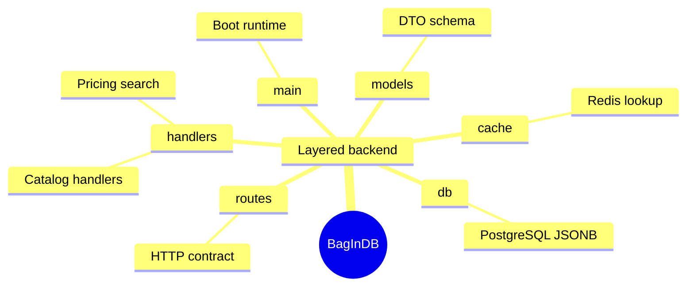

<div class="hub-header">
  <p class="hub-kicker">프로젝트 / 장비 도메인</p>
  <h2>장비와 브랜드 빅데이터DB 백엔드</h2>
  <p class="hub-lede">
    BagInDB는 장비, 브랜드, 제품 스펙 탐색을 커뮤니티 서비스와 분리해도 되는지 검증한 백엔드입니다.
    핵심은 Rust를 썼다는 사실보다, 읽기 중심 장비 데이터를 별도 도메인으로 떼어냈을 때 어떤 API 계층, 어떤 스키마 유연성, 어떤 캐시 전략이 필요한지 실제 구조로 확인한 점입니다.
  </p>
</div>

<section class="hub-section">
  <p class="hub-section-kicker">요약</p>
  <h3>빠른 정보</h3>
  <div class="hub-grid">
    <div class="hub-card">
      <span class="hub-label">형태</span>
      <strong>개인 프로젝트 / 분리 백엔드 서비스</strong>
      <p>BagInCoffee에서 읽기 중심 장비 도메인을 별도 서비스로 떼어낼 수 있는지 검증한 백엔드 프로젝트입니다.</p>
    </div>
    <div class="hub-card">
      <span class="hub-label">역할</span>
      <strong>데이터 모델링, Rust API, Redis 캐시, JWT 검증</strong>
      <p>도메인 분리 판단부터 API 표면, 캐시 전략, 문서화까지 직접 맡았습니다.</p>
    </div>
    <div class="hub-card">
      <span class="hub-label">핵심 결과</span>
      <strong>15개 이상 엔드포인트와 10ms 이하 응답 목표</strong>
      <p>브랜드, 카테고리, 제품, 필터 검색을 별도 서비스로 묶고 JSONB와 Redis 앞단 전략을 함께 검증했습니다.</p>
    </div>
    <div class="hub-card">
      <span class="hub-label">현재 상태</span>
      <strong>독립 서비스 구조 확인, 운영 정책 보강 중</strong>
      <p>강점은 분리 판단과 조회 구조 검증에 있고, 무효화 기준과 장기 운영 정책은 더 다듬는 단계입니다.</p>
    </div>
  </div>
</section>

<section class="hub-section">
  <p class="hub-section-kicker">Spec</p>
  <h3>Spec 주도 개발</h3>
  <ul class="hub-list">
    <li class="hub-item">
      <a href="./spec">
        <span class="hub-label">Spec</span>
        <strong>BagInDB Spec</strong>
        <p>장비 도메인을 무작정 분리하지 않고, 어떤 조회 구조와 응답 기준이 독립 서비스의 성공 조건인지 먼저 정리한 문서입니다. BagInDB는 문제, 목표, 핵심 결정, acceptance 기준을 먼저 고정한 뒤 구현을 확장했습니다.</p>
      </a>
    </li>
  </ul>
</section>

<section class="hub-section">
  <p class="hub-section-kicker">실행</p>
  <h3>실행 화면</h3>
  <div class="hub-proof-grid">
    <div class="hub-proof-card">
      <div class="hub-proof-media">
        <pre class="hub-proof-code"><code>BagInCoffee Client
        |
Community / Auth
        |
     BagInDB
   /    |     \
Route Handler Cache
        |       |
     PostgreSQL JSONB
        |
  Brand / Category / Product Search</code></pre>
      </div>
      <span class="hub-label">경계 증명</span>
      <strong>커뮤니티 흐름과 장비 탐색 흐름의 리듬이 달랐기 때문에, BagInDB를 별도 도메인 서비스로 분리하는 편이 맞았습니다</strong>
      <p>BagInDB는 단순 CRUD 서버가 아니라, 브랜드와 제품 스펙 탐색을 커뮤니티 피드와 다른 데이터 경계로 옮겨야 한다는 판단을 API 구조로 증명한 프로젝트입니다.</p>
    </div>
    <div class="hub-proof-card">
      <span class="hub-label">관찰 지표</span>
      <strong>15개 이상 엔드포인트, 다국어 모델링, 캐시 적중 구간 10ms 이하 응답 목표까지 읽기 중심 구조를 실제로 연결했습니다</strong>
      <p>브랜드, 카테고리, 제품 목록과 상세, 필터 검색, JWT 검증 흐름을 분리된 서비스로 묶었고, 인기 조회 구간은 Redis 앞단으로 줄이는 전략을 함께 검증했습니다.</p>
    </div>
  </div>
</section>

<section class="hub-section">
  <p class="hub-section-kicker">배경</p>
  <h3>배경</h3>
  <ul class="hub-list">
    <li class="hub-item">
      <div class="hub-note">
        <span class="hub-label">문제</span>
        <p>커뮤니티 데이터는 사용자와 콘텐츠 중심이지만, 장비 데이터는 브랜드, 카테고리, 제품 스펙, 필터 검색, 다국어 표현처럼 전혀 다른 읽기 패턴을 갖고 있었습니다. 그래서 독립적인 DB 시스템으로 진행을 하기로 방향을 정하게됬습니다..</p>
      </div>
    </li>
    <li class="hub-item">
      <div class="hub-note">
        <span class="hub-label">전환</span>
        <p>그래서 BagInDB는 BagInCoffee의 부속 API가 아니라, 읽기 중심 장비 도메인을 별도 서비스로 떼어낼 수 있는지 검증하는 백엔드 프로젝트가 됐습니다.</p>
      </div>
    </li>
    <li class="hub-item">
      <div class="hub-note">
        <span class="hub-label">범위</span>
        <p>1인 개발로 데이터 모델링, API 설계, 캐시 전략, JWT 검증, 문서화까지 직접 맡았고, 현재는 독립 서비스로 유지 가능한 구조를 확인한 상태입니다.</p>
      </div>
    </li>
  </ul>
</section>

<section class="hub-section">
  <p class="hub-section-kicker">판단</p>
  <h3>판단</h3>
  <ul class="hub-list">
    <li class="hub-item">
      <div class="hub-note">
        <span class="hub-label">판단 1</span>
        <p>장비 도메인을 커뮤니티 백엔드와 분리했습니다. 접근 패턴과 변경 방식이 다른 데이터를 한 서비스에 계속 쌓는 편이 오히려 운영 비용을 키운다고 판단했기 때문입니다.</p>
      </div>
    </li>
    <li class="hub-item">
      <div class="hub-note">
        <span class="hub-label">판단 2</span>
        <p>정규화 중심 스키마만 고집하지 않고 JSONB 기반 스펙 저장을 택했습니다. 카테고리별 속성이 달라, 응답 유연성을 포기하는 편이 더 큰 비용이라고 봤기 때문입니다.</p>
      </div>
    </li>
    <li class="hub-item">
      <div class="hub-note">
        <span class="hub-label">판단 3</span>
        <p>Rust와 Redis 조합을 선택했습니다. 반복 조회가 많은 API를 낮은 리소스로 운영하려면 응답 비용과 캐시 전략을 처음부터 함께 설계하는 편이 맞다고 판단했기 때문입니다. 여기서 Nas에 서버를 올리는 시스템을 목표로 최적화를 진행하는 부분이기때문에 Rust를 선택하게 됬습니다.</p>
      </div>
    </li>
  </ul>
</section>

<section class="hub-section">
  <p class="hub-section-kicker">검증</p>
  <h3>검증</h3>
  <ul class="hub-list">
    <li class="hub-item">
      <div class="hub-note">
        <span class="hub-label">관찰</span>
        <p>브랜드, 카테고리, 제품 목록과 상세, 필터 기반 조회, JWT 검증 흐름까지 장비 데이터 API 전반을 실제로 연결했습니다.</p>
      </div>
    </li>
    <li class="hub-item">
      <div class="hub-note">
        <span class="hub-label">캐시</span>
        <p>인기 브랜드와 인기 제품처럼 반복 조회가 많은 구간에서는 Redis 효과가 분명했고, 반대로 꼬리 조회가 많은 구간은 캐시 미스가 자주 난다는 점도 같이 확인했습니다.</p>
      </div>
    </li>
    <li class="hub-item">
      <div class="hub-note">
        <span class="hub-label">범위</span>
        <p>핵심은 CRUD가 아니라 장비 데이터의 다국어 모델링, 캐싱, 무효화, 분리 운영 가능성까지 함께 확인했다는 점입니다.</p>
      </div>
    </li>
  </ul>
</section>

<section class="hub-section">
  <p class="hub-section-kicker">한계</p>
  <h3>한계</h3>
  <ul class="hub-list">
    <li class="hub-item">
      <div class="hub-note">
        <span class="hub-label">한계</span>
        <p>현재 강점은 도메인 분리와 조회 구조 검증에 있고, 장기 운영 기준으로 어떤 무효화 정책과 데이터 관리 전략이 가장 단순한지는 더 다듬어야 합니다.</p>
      </div>
    </li>
    <li class="hub-item">
      <div class="hub-note">
        <span class="hub-label">위험</span>
        <p>JSONB와 캐시 전략은 유연하지만, 스키마 관리와 무효화 기준이 느슨하면 운영 복잡도가 빠르게 올라갈 수 있습니다.</p>
      </div>
    </li>
    <li class="hub-item">
      <div class="hub-note">
        <span class="hub-label">다음</span>
        <p>다음 단계는 인기 조회와 꼬리 조회를 분리한 캐시 정책, 더 나은 검색 정렬, 데이터 수집과 정규화 파이프라인 자동화까지 연결하는 것입니다.</p>
      </div>
    </li>
  </ul>
</section>

<section class="hub-section">
  <p class="hub-section-kicker">흐름</p>
  <h3>흐름</h3>
  <ul class="hub-list">
    <li class="hub-item">
      <div class="hub-note">
        <span class="hub-label">1단계</span>
        <strong>커뮤니티 서비스 안에 있던 장비 데이터를 먼저 별도 도메인으로 떼어냈습니다</strong>
        <p>출발점은 BagInCoffee 내부 기능이었지만, 장비 데이터는 반복 조회와 탐색 중심이라 커뮤니티 데이터와 다른 요구를 가진다고 판단했습니다.</p>
      </div>
    </li>
    <li class="hub-item">
      <div class="hub-note">
        <span class="hub-label">2단계</span>
        <strong>탐색형 API와 JSONB 모델을 먼저 설계해 읽기 중심 서비스를 만들었습니다</strong>
        <p><a href="./api-surface">브랜드, 카테고리, 제품 상세, 필터 검색 API</a>를 먼저 잡고, 카테고리별로 달라지는 속성은 JSONB 기반으로 다뤘습니다.</p>
      </div>
    </li>
    <li class="hub-item">
      <div class="hub-note">
        <span class="hub-label">3단계</span>
        <strong>routes, handlers, cache, db, models를 분리해 읽기 경로를 명확하게 만들었습니다</strong>
        <p><code>routes -&gt; handlers -&gt; cache/db -&gt; models</code> 흐름으로 계층을 나눠, 외부 계약과 내부 조회 책임이 섞이지 않게 구조를 잡았습니다.</p>
      </div>
    </li>
    <li class="hub-item">
      <div class="hub-note">
        <span class="hub-label">4단계</span>
        <strong>캐시가 잘 맞는 조회와 안 맞는 조회를 분리해서 관찰했고, 그 결과를 다음 설계로 남겼습니다</strong>
        <p><a href="./cache-strategy">캐시 전략</a>에 정리했듯 인기 조회에서는 효과가 컸지만 꼬리 조회에서는 캐시 미스가 늘었습니다. 그래서 이 프로젝트는 구현 소개가 아니라 어떤 최적화가 실제로 유효했는지까지 함께 남긴 문서가 됩니다.</p>
      </div>
    </li>
  </ul>
</section>

<section class="hub-section">
  <p class="hub-section-kicker">아키텍처</p>
  <h3>아키텍처</h3>
  <ul class="hub-list">
    <li class="hub-item">
      <div class="hub-note">
        <span class="hub-label">선택 구조</span>
        <p>BagInDB는 헥사고날이나 마이크로서비스 묶음이 아니라, 장비 탐색만 떼어낸 단일 백엔드 서비스입니다. 내부 구조는 도메인별 핸들러를 중심에 둔 layered architecture에 가깝습니다.</p>
      </div>
    </li>
    <li class="hub-item">
      <div class="hub-note">
        <span class="hub-label">핵심 경계</span>
        <p>요청은 <code>main -&gt; routes -&gt; handlers -&gt; cache/db -&gt; models</code> 흐름으로 흘러갑니다. `routes`는 계약, `handlers`는 조회 기능, `cache`는 응답 최적화, `db`는 연결, `models`는 데이터 의미를 고정합니다.</p>
      </div>
    </li>
    <li class="hub-item">
      <div class="hub-note">
        <span class="hub-label">실행 흐름</span>
        <p>외부에서는 하나의 장비 API처럼 보이지만, 내부적으로는 브랜드, 카테고리, 제품, 가격 기능이 핸들러 단위로 갈라지고 읽기 요청은 Redis와 PostgreSQL JSONB를 함께 거칩니다. 자세한 메서드와 폴더 기능은 <a href="./folder-feature-map">폴더 기능 맵</a>과 보조 문서에서 이어집니다.</p>
      </div>
    </li>
  </ul>
</section>



<section class="hub-section">
  <p class="hub-section-kicker">원본</p>
  <h3>원본</h3>
  <ul class="hub-list">
    <li class="hub-item">
      <a href="https://github.com/BbangMxn/BagInCoffee/tree/main/BagInDB">
        <span class="hub-label">깃허브</span>
        <strong>BagInCoffee / BagInDB</strong>
        <p>BagInCoffee 저장소 안에서 장비 도메인 서비스를 별도 디렉터리로 분리해 관리하는 공개 저장소입니다.</p>
      </a>
    </li>
    <li class="hub-item">
      <a href="../BagInCoffee">
        <span class="hub-label">상위 프로젝트</span>
        <strong>BagInCoffee</strong>
        <p>커뮤니티와 장비 데이터를 한 서비스에 두지 않고, 장비 영역만 따로 떼어낸 상위 프로젝트입니다.</p>
      </a>
    </li>
  </ul>
</section>

<section class="hub-section">
  <p class="hub-section-kicker">구조</p>
  <h3>구조</h3>
  <ul class="hub-list">
    <li class="hub-item">
      <a href="./folder-feature-map">
        <span class="hub-label">폴더 기능</span>
        <strong>BagInDB 폴더 기능 맵</strong>
        <p><code>src</code>, <code>supabase</code>, <code>docs</code>와 그 아래 <code>handlers</code>, <code>middleware</code>, <code>cache</code>가 실제로 어떤 기능을 맡는지 기능 단위로 정리합니다.</p>
      </a>
    </li>
  </ul>
</section>

<section class="hub-section">
  <p class="hub-section-kicker">파일</p>
  <h3>파일 구조</h3>

```text
BagInDB/
├── src/
│   ├── routes/
│   ├── handlers/
│   ├── middleware/
│   ├── cache/
│   ├── db/
│   └── models/
├── docs/
├── supabase/
│   └── migrations/
├── ADMIN_SETUP_GUIDE.md
├── DB_SCHEMA.md
├── DB_STRUCTURE.md
├── DEPLOYMENT.md
├── JSONB_FILTER_GUIDE.md
├── README.md
└── Cargo.toml
```

<p>이 트리는 입구만 보여 줍니다. 실제 요청 경계와 구조 선택은 위 아키텍처 섹션에서, 폴더별 역할은 <a href="./folder-feature-map">폴더 기능 맵</a>에서 이어서 설명합니다.</p>

</section>
