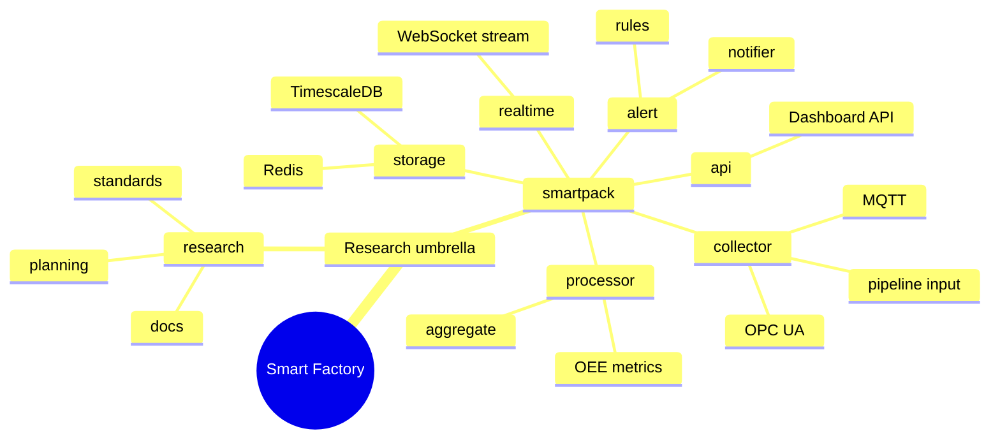

<div class="hub-header">
  <p class="hub-kicker">프로젝트 / IoT 연구</p>
  <h2>스마트 팩토리 구조를 검토한 연구형 저장소</h2>
  <p class="hub-lede">
    스마트 팩토리 문제는 단순 대시보드 구현이 아니라, 어떤 프로토콜로 데이터를 수집하고 어떤 저장소에 쌓고 어떤 방식으로 실시간성과 운영성을 맞출 것인가의 문제에 가깝습니다. 이 프로젝트는 그 판단을 연구 문서와 구현 구조를 함께 두는 방식으로 정리했습니다.
  </p>
</div>

<section class="hub-section">
  <p class="hub-section-kicker">요약</p>
  <h3>빠른 정보</h3>
  <div class="hub-grid">
    <div class="hub-card">
      <span class="hub-label">형태</span>
      <strong>연구 + 구현 저장소</strong>
      <p>스마트 팩토리 구조를 문제 정의, 통신 표준, 구현체 설계까지 한 저장소 안에서 함께 다루는 연구형 프로젝트입니다.</p>
    </div>
    <div class="hub-card">
      <span class="hub-label">역할</span>
      <strong>아키텍처 정리, 프로토콜 분석, 구현 방향 설계</strong>
      <p>연구 문서와 백엔드 구현 구조를 같이 정리하며 collector, storage, realtime, alert 흐름을 설계했습니다.</p>
    </div>
    <div class="hub-card">
      <span class="hub-label">핵심 결과</span>
      <strong>OPC UA / MQTT -> TimescaleDB / Redis / WebSocket</strong>
      <p>다중 프로토콜 수집과 시계열 저장, 실시간 전송, 알림 흐름을 하나의 파이프라인 구조로 설명했습니다.</p>
    </div>
    <div class="hub-card">
      <span class="hub-label">현재 상태</span>
      <strong>설계 범위 검증, 운영 지표는 추후 확장</strong>
      <p>강점은 문제와 구조를 함께 정리한 점이고, 실제 운영 지표와 대규모 검증은 앞으로 보강할 범위로 남아 있습니다.</p>
    </div>
  </div>
</section>

<section class="hub-section">
  <p class="hub-section-kicker">Spec</p>
  <h3>Spec 주도 개발</h3>
  <ul class="hub-list">
    <li class="hub-item">
      <a href="./spec">
        <span class="hub-label">Spec</span>
        <strong>Smart Factory Spec</strong>
        <p>이 영역은 코드보다 아키텍처 선택이 먼저라서, 프로토콜, 저장, 실시간 전송의 성공 조건을 먼저 정리한 문서입니다. Smart Factory는 문제, 목표, 핵심 결정, acceptance 기준을 먼저 고정한 뒤 구현과 연구를 함께 전개했습니다.</p>
      </a>
    </li>
  </ul>
</section>

<section class="hub-section">
  <p class="hub-section-kicker">배경</p>
  <h3>배경</h3>
  <ul class="hub-list">
    <li class="hub-item">
      <div class="hub-note">
        <span class="hub-label">문제</span>
        <p>스마트 팩토리 시스템은 장비 데이터 수집, 프로토콜 선택, 시계열 저장, 실시간 모니터링, 이상 알림이 모두 연결되어야 해서 구현보다 설계 판단이 먼저 필요한 영역이었습니다.</p>
      </div>
    </li>
    <li class="hub-item">
      <div class="hub-note">
        <span class="hub-label">접근</span>
        <p>그래서 Smart Factory는 구현체만 두는 대신, 산업 분석과 통신 표준 비교, 시스템 설계, 프로토타입 구현을 한 저장소 안에서 함께 다루는 구조를 택했습니다.</p>
      </div>
    </li>
    <li class="hub-item">
      <div class="hub-note">
        <span class="hub-label">범위</span>
        <p>연구 문서와 실제 구현체를 함께 정리하며 아키텍처, 프로토콜 분석, 백엔드 구현 방향을 직접 설계했고, 현재는 연구와 구현이 같이 들어있는 저장소 형태로 구조화되어 있습니다.</p>
      </div>
    </li>
  </ul>
</section>

<section class="hub-section">
  <p class="hub-section-kicker">판단</p>
  <h3>판단</h3>
  <ul class="hub-list">
    <li class="hub-item">
      <div class="hub-note">
        <span class="hub-label">판단 1</span>
        <p>OPC UA와 MQTT를 함께 다루는 다중 프로토콜 구조를 전제로 잡았습니다. 스마트 팩토리에서는 한 가지 프로토콜만 기준으로 삼는 편이 실제 환경을 충분히 설명하지 못한다고 봤기 때문입니다.</p>
      </div>
    </li>
    <li class="hub-item">
      <div class="hub-note">
        <span class="hub-label">판단 2</span>
        <p>시계열 데이터 저장을 위해 TimescaleDB를 중심에 두고 Redis와 WebSocket을 연결했습니다. 단순 CRUD 저장소보다 시간축과 실시간성을 먼저 고려해야 한다고 판단했기 때문입니다.</p>
      </div>
    </li>
    <li class="hub-item">
      <div class="hub-note">
        <span class="hub-label">판단 3</span>
        <p>구현체만 두지 않고 연구 문서를 함께 뒀습니다. 이 영역은 아키텍처와 표준 선택의 근거가 구현만큼 중요하다고 봤기 때문입니다.</p>
      </div>
    </li>
  </ul>
</section>

<section class="hub-section">
  <p class="hub-section-kicker">검증</p>
  <h3>검증</h3>
  <ul class="hub-list">
    <li class="hub-item">
      <div class="hub-note">
        <span class="hub-label">검증 범위</span>
        <p>산업 분석, 통신 표준 비교, 시스템 설계, 실제 구현체를 하나의 저장소 안에 연결해, 문제를 연구 단계와 구현 단계로 분리하지 않고 다룰 수 있는 구조를 만들었습니다.</p>
      </div>
    </li>
    <li class="hub-item">
      <div class="hub-note">
        <span class="hub-label">흐름</span>
        <p>OPC UA/MQTT Collector, Pipeline, TimescaleDB, Redis Cache, WebSocket Dashboard, Alert 흐름으로 이어지는 전체 아키텍처를 문서와 구조 양쪽에서 정리했습니다.</p>
      </div>
    </li>
    <li class="hub-item">
      <div class="hub-note">
        <span class="hub-label">설계 범위</span>
        <p>핵심 가치는 운영 중인 대규모 수치보다도, 어떤 문제를 어떤 구성으로 풀어야 하는지에 대한 설계 범위를 분명히 잡았다는 데 있습니다.</p>
      </div>
    </li>
  </ul>
</section>

<section class="hub-section">
  <p class="hub-section-kicker">한계</p>
  <h3>한계</h3>
  <ul class="hub-list">
    <li class="hub-item">
      <div class="hub-note">
        <span class="hub-label">한계</span>
        <p>이 프로젝트는 구조와 방향을 정리하는 데 강점이 있지만, 아직 운영 지표나 대규모 실사용 검증을 말할 단계는 아닙니다.</p>
      </div>
    </li>
    <li class="hub-item">
      <div class="hub-note">
        <span class="hub-label">위험</span>
        <p>다중 프로토콜과 실시간 흐름은 설계가 복잡해지기 쉬워, 구현이 늘어날수록 실제 운영 복잡도를 어떻게 제어할지가 중요한 과제로 남아 있습니다.</p>
      </div>
    </li>
    <li class="hub-item">
      <div class="hub-note">
        <span class="hub-label">다음</span>
        <p>다음 단계는 현재 정리된 설계가 실제 구현과 운영 시나리오에서 얼마나 일관되게 유지되는지 더 구체적으로 검증하는 것입니다.</p>
      </div>
    </li>
  </ul>
</section>

<section class="hub-section">
  <p class="hub-section-kicker">흐름</p>
  <h3>흐름</h3>
  <ul class="hub-list">
    <li class="hub-item">
      <div class="hub-note">
        <span class="hub-label">1단계</span>
        <strong>먼저 산업 문제와 요구사항을 문서로 정리하며 어떤 시스템을 만들지 범위를 확정했습니다</strong>
        <p>이 프로젝트는 코드보다 설계 판단이 먼저 필요한 영역이라, 수집 대상 데이터와 운영 조건을 먼저 연구 문서로 정리했습니다. 구현은 그다음 단계였습니다.</p>
      </div>
    </li>
    <li class="hub-item">
      <div class="hub-note">
        <span class="hub-label">2단계</span>
        <strong>수집 계층에서는 OPC UA와 MQTT를 함께 보는 다중 프로토콜 구조를 잡았습니다</strong>
        <p><a href="./protocol-stack">Protocol Stack</a>에 정리했듯, 현장 환경을 한 가지 표준으로 단순화하지 않고 수집 어댑터를 분리하는 쪽으로 방향을 잡았습니다.</p>
      </div>
    </li>
    <li class="hub-item">
      <div class="hub-note">
        <span class="hub-label">3단계</span>
        <strong>수집 이후에는 시계열 저장과 실시간 전송을 분리한 파이프라인을 설계했습니다</strong>
        <p><a href="./timeseries-pipeline">Timeseries Pipeline</a>처럼 Collector, Pipeline, TimescaleDB, Redis, WebSocket, Dashboard, Alert로 이어지는 전체 흐름을 단계별로 정리했습니다.</p>
      </div>
    </li>
    <li class="hub-item">
      <div class="hub-note">
        <span class="hub-label">4단계</span>
        <strong>연구 문서와 구현체를 한 저장소에 같이 두어 설계 근거와 구현 방향이 분리되지 않게 했습니다</strong>
        <p>그래서 이 메인 페이지는 “무엇을 구현했는가”보다 “어떤 문제를 어떤 순서로 다뤘는가”까지 한 번에 보이도록 유지합니다. 더 자세한 입구는 <a href="./start-here">시작 가이드</a>에서 이어집니다.</p>
      </div>
    </li>
  </ul>
</section>

<section class="hub-section">
  <p class="hub-section-kicker">아키텍처</p>
  <h3>아키텍처</h3>
  <ul class="hub-list">
    <li class="hub-item">
      <div class="hub-note">
        <span class="hub-label">선택 구조</span>
        <p>Smart Factory는 연구 문서와 구현체를 같이 둔 umbrella repository이고, 실제 구현인 `smartpack`은 마이크로서비스보다 pipeline-oriented modular monolith에 가깝습니다. 수집, 처리, 저장, 실시간 전송, 알림이 한 서버 구조 안에서 모듈로 나뉩니다.</p>
      </div>
    </li>
    <li class="hub-item">
      <div class="hub-note">
        <span class="hub-label">핵심 경계</span>
        <p><code>research</code>는 문제 정의와 표준 선택 근거를 남기고, <code>smartpack</code>은 `collector`, `processor`, `storage`, `realtime`, `alert`, `api`로 실행 기능을 분리합니다. 여기서는 헥사고날보다 파이프라인 경계가 더 중요합니다.</p>
      </div>
    </li>
    <li class="hub-item">
      <div class="hub-note">
        <span class="hub-label">실행 흐름</span>
        <p>전체 시스템은 <code>OPC UA / MQTT -&gt; collector pipeline -&gt; TimescaleDB / Redis -&gt; realtime / alert -&gt; API</code>로 읽는 편이 가장 빠릅니다. 더 자세한 폴더 역할과 메서드는 <a href="./folder-feature-map">폴더 기능 맵</a>과 파이프라인 문서에서 이어집니다.</p>
      </div>
    </li>
  </ul>
</section>

<section class="hub-section">
  <p class="hub-section-kicker">구조</p>
  <h3>구조</h3>
  <ul class="hub-list">
    <li class="hub-item">
      <a href="./folder-feature-map">
        <span class="hub-label">폴더 기능</span>
        <strong>Smart Factory 폴더 기능 맵</strong>
        <p><code>research</code>의 설계 문서와 <code>smartpack</code>의 collector, processor, storage, realtime, alert 기능을 폴더별로 정리합니다.</p>
      </a>
    </li>
  </ul>
</section>



<section class="hub-section">
  <p class="hub-section-kicker">원본</p>
  <h3>원본</h3>
  <ul class="hub-list">
    <li class="hub-item">
      <a href="https://github.com/BbangMxn/smartfactory">
        <span class="hub-label">깃허브</span>
        <strong>BbangMxn/smartfactory</strong>
        <p>연구 문서와 실제 구현체를 한 저장소에 담아 스마트 팩토리 시스템을 단계적으로 검증한 프로젝트입니다.</p>
      </a>
    </li>
    <li class="hub-item">
      <a href="https://github.com/BbangMxn/smartpack">
        <span class="hub-label">구현 저장소</span>
        <strong>BbangMxn/smartpack</strong>
        <p>실제 Collector, Processor, Storage, Realtime, Alert 모듈이 나뉜 구현체 저장소입니다.</p>
      </a>
    </li>
  </ul>
</section>

<section class="hub-section">
  <p class="hub-section-kicker">파일</p>
  <h3>파일 구조</h3>

```text
smartfactory/
├── research/
│   ├── planning/
│   ├── docs/
│   └── impl/
└── smartpack/
    ├── cmd/
    ├── internal/
    │   ├── collector/
    │   ├── processor/
    │   ├── storage/
    │   ├── realtime/
    │   ├── api/
    │   └── alert/
    └── deployments/
```

<p>이 트리는 연구와 구현이 같이 있다는 사실만 보여 줍니다. 실제로 왜 두 축을 분리했고 구현체는 어떤 파이프라인 기준으로 읽어야 하는지는 위 아키텍처 섹션과 <a href="./folder-feature-map">폴더 기능 맵</a>에서 더 자세히 정리했습니다.</p>

</section>
