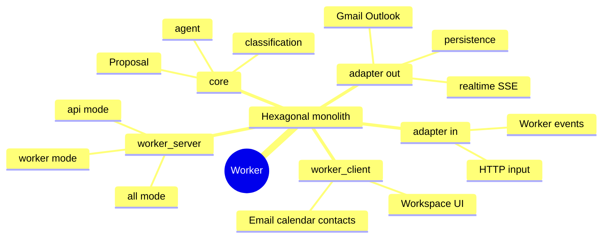

<div class="hub-header">
  <p class="hub-kicker">프로젝트 / 업무 자동화</p>
  <h2>AI 워크스페이스로 다시 설계한 업무 도구</h2>
  <p class="hub-lede">
    처음 목표는 이메일, 캘린더, 연락처를 한 화면에 모으는 것이었지만, 구현을 진행할수록 더 중요한 문제는 AI Agent가 실제 업무 도구 안에서 어떻게 안전하게 동작해야 하는가였습니다. Worker는 기능 구현뿐 아니라 어떤 구조가 과했고 무엇을 줄여야 했는지까지 함께 남긴 프로젝트입니다.
  </p>
</div>

<section class="hub-section">
  <p class="hub-section-kicker">요약</p>
  <h3>빠른 정보</h3>
  <div class="hub-grid">
    <div class="hub-card">
      <span class="hub-label">형태</span>
      <strong>개인 프로젝트 / AI 워크스페이스 실험</strong>
      <p>업무 도구에 AI Agent를 넣을 때 필요한 안전장치와 동기화 구조를 검증하는 공개 프로젝트입니다.</p>
    </div>
    <div class="hub-card">
      <span class="hub-label">역할</span>
      <strong>Next.js UI, Go 백엔드, AI 파이프라인, 데이터 설계</strong>
      <p>워크스페이스 UI, 분류 구조, Proposal 안전장치, Gmail 동기화, 문서화까지 직접 맡았습니다.</p>
    </div>
    <div class="hub-card">
      <span class="hub-label">핵심 결과</span>
      <strong>Proposal, Gmail 동기화, 7단계 분류, 개인화 답장</strong>
      <p>불필요한 LLM 호출을 줄이는 분류 방향을 검토했고 제안과 확인이 있는 업무 흐름을 실제로 연결했습니다. 다만 약 75% 수치는 추가 검증이 필요합니다.</p>
    </div>
    <div class="hub-card">
      <span class="hub-label">현재 상태</span>
      <strong>동작 검증 완료, 구조 단순화 진행 중</strong>
      <p>검증이 끝난 뒤 과했던 4개 DB 구성을 줄이며 더 단순한 구조로 재정리하는 단계입니다.</p>
    </div>
  </div>
</section>

<section class="hub-section">
  <p class="hub-section-kicker">Spec</p>
  <h3>Spec 주도 개발</h3>
  <ul class="hub-list">
    <li class="hub-item">
      <a href="./spec">
        <span class="hub-label">Spec</span>
        <strong>Worker Spec</strong>
        <p>AI 기능을 늘리기 전에 제안-실행 경계와 분류 기준을 먼저 정리한 문서입니다. Worker는 문제, 목표, 핵심 결정, acceptance 기준을 먼저 고정한 뒤 구현을 이어갔습니다.</p>
      </a>
    </li>
  </ul>
</section>

<section class="hub-section">
  <p class="hub-section-kicker">실행</p>
  <h3>실행 화면</h3>
  <div class="hub-proof-grid">
    <div class="hub-proof-card">
      <div class="hub-proof-media">
        <pre class="hub-proof-code"><code>User Request
     |
Intent + Proposal
     |
Classification Rules
     |
Realtime Sync (SSE)
     |
Personalized Reply</code></pre>
      </div>
      <span class="hub-label">흐름 도식</span>
      <strong>Proposal, 분류, 동기화, 답장을 하나의 업무 워크플로로 묶어 AI를 안전하게 배치했습니다</strong>
      <p>기존 <code>docs/ARCHITECTURE.md</code> 구조를 압축하면, Worker의 핵심은 AI가 바로 실행하지 않고 제안과 확인, 분류와 동기화, 개인화 답장으로 이어지는 흐름을 갖는다는 점입니다.</p>
    </div>
    <div class="hub-proof-card">
      <span class="hub-label">검증 범위</span>
      <strong>Proposal 생성, Gmail 실시간 동기화, 7단계 분류, 문체 학습 답장까지 이어지는 흐름을 실제로 검증했습니다</strong>
      <p>이메일 자동 번역, 분류, 요약, Gmail 실시간 동기화, RAG 기반 개인화 답장 구조를 확인했고, 7단계 분류 파이프라인이 LLM 호출량을 줄이는 방향인지는 검토했습니다. 다만 약 75% 수치는 추가 검증이 필요합니다.</p>
    </div>
  </div>
</section>

<section class="hub-section">
  <p class="hub-section-kicker">배경</p>
  <h3>배경</h3>
  <ul class="hub-list">
    <li class="hub-item">
      <div class="hub-note">
        <span class="hub-label">문제</span>
        <p>업무 도구는 이메일, 캘린더, 연락처가 분리되어 있고, 사용자는 분류와 정리를 반복해서 직접 해야 합니다. 단순 메일 클라이언트 구현만으로는 이 문제를 충분히 다뤘다고 보기 어려웠습니다.</p>
      </div>
    </li>
    <li class="hub-item">
      <div class="hub-note">
        <span class="hub-label">전환</span>
        <p>그래서 Worker는 화면 통합 프로젝트가 아니라, AI Agent가 실제 업무 흐름 안에서 제안과 실행을 어떻게 다뤄야 하는지 검증하는 워크스페이스 실험으로 방향이 바뀌었습니다.</p>
      </div>
    </li>
    <li class="hub-item">
      <div class="hub-note">
        <span class="hub-label">범위</span>
        <p>1인 개발로 제품 방향, 프론트엔드, 백엔드, AI 파이프라인, 데이터 설계, 문서화를 맡았고, 현재는 동작 검증을 마친 뒤 구조를 다시 정리하는 단계입니다.</p>
      </div>
    </li>
  </ul>
</section>

<section class="hub-section">
  <p class="hub-section-kicker">판단</p>
  <h3>판단</h3>
  <ul class="hub-list">
    <li class="hub-item">
      <div class="hub-note">
        <span class="hub-label">판단 1</span>
        <p>AI가 바로 작업을 실행하지 않도록 Proposal 기반 구조를 택했습니다. 이메일 전송이나 일정 생성은 실수 비용이 크기 때문에, 자동화보다도 확인 가능한 안전 장치가 먼저라고 판단했기 때문입니다.</p>
      </div>
    </li>
    <li class="hub-item">
      <div class="hub-note">
        <span class="hub-label">판단 2</span>
        <p>이메일 분류에서 모든 요청을 바로 LLM으로 보내지 않고 7단계 분류 파이프라인을 만들었습니다. 비용을 줄이는 것뿐 아니라, 어떤 규칙이 실제로 유효한지 먼저 확인하고 싶었기 때문입니다.</p>
      </div>
    </li>
    <li class="hub-item">
      <div class="hub-note">
        <span class="hub-label">판단 3</span>
        <p>PostgreSQL, MongoDB, Redis, Neo4j를 역할별로 나눴지만, 검증이 끝난 뒤에는 이 구성이 과했다는 점도 함께 확인했습니다. Worker는 복잡한 구조를 채택한 경험과 그것을 다시 줄이려는 판단까지 포함하는 프로젝트입니다.</p>
      </div>
    </li>
  </ul>
</section>

<section class="hub-section">
  <p class="hub-section-kicker">검증</p>
  <h3>검증</h3>
  <ul class="hub-list">
    <li class="hub-item">
      <div class="hub-note">
        <span class="hub-label">업무 흐름</span>
        <p>이메일, 캘린더, 연락처, AI 채팅과 명령 인터페이스를 하나의 UI로 묶었고, 업무 도구를 분리된 앱이 아니라 하나의 워크스페이스로 다루는 흐름은 실제로 확인했습니다.</p>
      </div>
    </li>
    <li class="hub-item">
      <div class="hub-note">
        <span class="hub-label">관찰</span>
        <p>이메일 자동 번역, 분류, 요약, Gmail 실시간 동기화, RAG 기반 개인화 답장 구조는 동작을 확인했고, 7단계 분류 구조가 LLM 호출량 절감에 유효한지는 계속 검증 중입니다. 약 75% 수치는 추가 검증이 필요합니다.</p>
      </div>
    </li>
    <li class="hub-item">
      <div class="hub-note">
        <span class="hub-label">범위</span>
        <p>특히 Proposal 생성, 분류 파이프라인, SSE 기반 동기화, 문체 학습과 개인화 답장까지 한 흐름으로 이어지는지 확인한 것이 이 프로젝트의 실제 검증 범위입니다.</p>
      </div>
    </li>
  </ul>
</section>

<section class="hub-section">
  <p class="hub-section-kicker">한계</p>
  <h3>한계</h3>
  <ul class="hub-list">
    <li class="hub-item">
      <div class="hub-note">
        <span class="hub-label">한계</span>
        <p>Proposal 생성은 가능하지만 실제 실행 연결은 일부 미완성이고, Outlook 동기화도 아직 보완이 필요합니다.</p>
      </div>
    </li>
    <li class="hub-item">
      <div class="hub-note">
        <span class="hub-label">위험</span>
        <p>Neo4j를 포함한 4개 DB 운영은 개인 프로젝트 기준으로 복잡도가 높았고, 유지 비용이 실제 이득보다 커질 수 있다는 점이 분명해졌습니다.</p>
      </div>
    </li>
    <li class="hub-item">
      <div class="hub-note">
        <span class="hub-label">다음</span>
        <p>다음 단계는 구조를 더 단순하게 줄이는 것입니다. PostgreSQL, MongoDB, Redis 중심으로 재정리하고, Proposal 실행 플로우를 완성하는 쪽이 현재 기준의 우선순위입니다.</p>
      </div>
    </li>
  </ul>
</section>

<section class="hub-section">
  <p class="hub-section-kicker">로드맵</p>
  <h3>추후 개발 방향</h3>
  <div class="hub-grid">
    <div class="hub-card">
      <span class="hub-label">현재 초점</span>
      <strong>구조 단순화</strong>
      <p>검증 단계에서 과했던 4개 DB 구성을 다시 줄이고, PostgreSQL, MongoDB, Redis 중심으로 운영 가능한 구조를 정리하는 것이 가장 우선입니다.</p>
    </div>
    <div class="hub-card">
      <span class="hub-label">다음 구현</span>
      <strong>Proposal 실행과 Outlook 동기화</strong>
      <p>지금은 제안 생성이 중심이지만, 다음 단계에서는 실제 실행 연결을 더 완성하고 Outlook 동기화 범위도 보강할 계획입니다.</p>
    </div>
    <div class="hub-card">
      <span class="hub-label">유지할 기준</span>
      <strong>안전장치와 관측 가능성</strong>
      <p>구조를 단순하게 줄이더라도 제안, 확인, 실시간 동기화, 실행 기록 같은 안전 기준은 유지하는 방향으로 정리합니다.</p>
    </div>
  </div>
</section>

<section class="hub-section">
  <p class="hub-section-kicker">마인드맵</p>
  <h3>다음에 보강할 축</h3>
  <div class="roadmap-visual">
    <div class="roadmap-visual-core">
      <span class="hub-label">Worker Next</span>
      <strong>검증한 기능은 유지하되 구조는 더 단순하게 줄입니다</strong>
      <p>Worker의 다음 단계는 기능을 더 덧붙이는 것보다 구조를 운영 가능한 수준으로 줄이는 데 있습니다. Proposal 실행, Outlook 동기화, 안전장치 유지 기준을 함께 묶어 정리합니다.</p>
    </div>
    <div class="roadmap-branch-grid">
      <article class="roadmap-branch is-structure">
        <span class="roadmap-branch-label">구조 단순화</span>
        <strong>운영 가능한 저장 구조로 다시 묶습니다</strong>
        <p>검증 단계에서 과했던 4개 DB 구성을 줄이고, 실제 유지 가능한 데이터 경계만 남기는 것이 가장 우선입니다.</p>
        <ul class="roadmap-branch-list">
          <li>PostgreSQL 중심 재정리</li>
          <li>MongoDB / Redis 재배치</li>
          <li>Neo4j 제거 여부 검토</li>
        </ul>
      </article>
      <article class="roadmap-branch is-product">
        <span class="roadmap-branch-label">제품 완성도</span>
        <strong>Proposal과 외부 연동을 실제 실행 흐름까지 잇습니다</strong>
        <p>지금은 제안 생성이 중심이므로, 다음 단계에서는 실제 실행 연결과 Outlook 동기화 범위를 더 분명히 완성할 계획입니다.</p>
        <ul class="roadmap-branch-list">
          <li>Proposal 실행 플로우</li>
          <li>Outlook 동기화 보강</li>
        </ul>
      </article>
      <article class="roadmap-branch is-ops">
        <span class="roadmap-branch-label">운영성</span>
        <strong>안전장치와 관측 가능성은 그대로 유지합니다</strong>
        <p>구조를 단순화해도 동기화 품질, 실행 기록, 제안-확인 안전장치 같은 운영 기준은 잃지 않도록 설계합니다.</p>
        <ul class="roadmap-branch-list">
          <li>동기화 품질</li>
          <li>안전장치 유지</li>
          <li>실행 관측 가능성</li>
        </ul>
      </article>
    </div>
  </div>
</section>

<section class="hub-section">
  <p class="hub-section-kicker">흐름</p>
  <h3>흐름</h3>
  <ul class="hub-list">
    <li class="hub-item">
      <div class="hub-note">
        <span class="hub-label">1단계</span>
        <strong>먼저 이메일, 캘린더, 연락처를 한 화면에서 다루는 워크스페이스 UI를 만들었습니다</strong>
        <p>출발점은 메일 도구 자체가 아니라 문맥 전환 비용을 줄이는 통합 화면이었습니다. 그래서 프론트엔드는 기능별 앱을 늘리는 대신 하나의 업무 공간을 만드는 방향으로 시작했습니다.</p>
      </div>
    </li>
    <li class="hub-item">
      <div class="hub-note">
        <span class="hub-label">2단계</span>
        <strong>백엔드에서는 Gmail 동기화와 SSE 기반 상태 전송을 먼저 연결했습니다</strong>
        <p>Go 서버에서 외부 메일 상태를 받고, 필요한 업데이트를 실시간으로 UI에 반영하는 흐름을 만들었습니다. 이 단계가 있어야 이후 AI 처리 결과도 실제 업무 도구 안에서 보일 수 있었습니다.</p>
      </div>
    </li>
    <li class="hub-item">
      <div class="hub-note">
        <span class="hub-label">3단계</span>
        <strong>모든 요청을 바로 LLM으로 보내지 않고 규칙 기반 분류와 후속 AI 처리를 나눴습니다</strong>
        <p><a href="./classification-pipeline">7단계 분류 파이프라인</a>을 두어, 코드로 처리 가능한 부분과 LLM이 필요한 부분을 분리했습니다. 비용과 설명 가능성을 동시에 잡기 위한 구현이었습니다.</p>
      </div>
    </li>
    <li class="hub-item">
      <div class="hub-note">
        <span class="hub-label">4단계</span>
        <strong>마지막으로 Proposal 단계를 넣어 AI가 바로 실행하지 않도록 안전장치를 걸었습니다</strong>
        <p><a href="./proposal-safety">Proposal Safety</a>처럼 메일 전송이나 일정 생성은 사용자 확인을 거치게 만들었습니다. 그리고 이 과정을 거치며 4개 DB 구조가 과했다는 점도 같이 확인해, 지금은 더 단순한 구조로 줄이는 방향을 다음 단계로 두고 있습니다.</p>
      </div>
    </li>
  </ul>
</section>

<section class="hub-section">
  <p class="hub-section-kicker">아키텍처</p>
  <h3>아키텍처</h3>
  <ul class="hub-list">
    <li class="hub-item">
      <div class="hub-note">
        <span class="hub-label">선택 구조</span>
        <p>Worker는 마이크로서비스가 아니라, 하나의 저장소와 하나의 서버 런타임 안에서 움직이는 hexagonal modular monolith입니다. 프론트엔드와 백엔드는 나뉘어 있지만 서버는 `api`, `worker`, `all` 모드를 가진 하나의 실행 단위입니다.</p>
      </div>
    </li>
    <li class="hub-item">
      <div class="hub-note">
        <span class="hub-label">핵심 경계</span>
        <p>서버는 <code>adapter/in -&gt; core -&gt; adapter/out</code>으로 읽으면 됩니다. 입력 어댑터가 HTTP와 워커 이벤트를 받고, `core/agent`와 `core/service/classification`이 판단을 만들고, 출력 어댑터가 Gmail, 저장소, SSE로 결과를 내보냅니다.</p>
      </div>
    </li>
    <li class="hub-item">
      <div class="hub-note">
        <span class="hub-label">실행 흐름</span>
        <p>전체 흐름은 <code>worker_client -&gt; http adapter -&gt; classification / proposal -&gt; provider sync / realtime</code>입니다. 메인 페이지에서는 이 요약만 보이고, 구체적인 메서드와 폴더 역할은 <a href="./folder-feature-map">폴더 기능 맵</a>과 보조 문서에서 이어집니다.</p>
      </div>
    </li>
  </ul>
</section>



<section class="hub-section">
  <p class="hub-section-kicker">원본</p>
  <h3>원본</h3>
  <ul class="hub-list">
    <li class="hub-item">
      <a href="https://github.com/BbangMxn/worker">
        <span class="hub-label">깃허브</span>
        <strong>BbangMxn/worker</strong>
        <p>AI 워크스페이스 실험 전체를 담은 공개 저장소입니다.</p>
      </a>
    </li>
  </ul>
</section>

<section class="hub-section">
  <p class="hub-section-kicker">구조</p>
  <h3>구조</h3>
  <ul class="hub-list">
    <li class="hub-item">
      <a href="./folder-feature-map">
        <span class="hub-label">폴더 기능</span>
        <strong>Worker 폴더 기능 맵</strong>
        <p><code>worker_client</code>의 화면 기능과 <code>worker_server</code>의 분류, Proposal, Provider 연동 기능을 폴더 기준으로 다시 정리합니다.</p>
      </a>
    </li>
  </ul>
</section>

<section class="hub-section">
  <p class="hub-section-kicker">파일</p>
  <h3>파일 구조</h3>

```text
worker/
├── worker_client/   # Next.js 14 frontend
│   └── src/{app,widgets,entities,shared,lib}
├── worker_server/   # Go backend
│   ├── adapter/{in,out}
│   ├── core/{agent,domain,port,service}
│   ├── internal/{bootstrap,stream}
│   ├── migrations/
│   └── document/
└── docs/            # 로드맵 및 설계 문서
```

<p>Worker는 루트 트리만으로는 읽기 어렵습니다. 실제로는 `worker_client`, `worker_server`, 그리고 서버 안의 `api/worker mode`와 `core/adapter` 경계를 같이 봐야 해서, 구조 요약은 위 아키텍처 섹션에서, 세부 폴더 설명은 <a href="./folder-feature-map">폴더 기능 맵</a>에서 이어집니다.</p>

</section>
