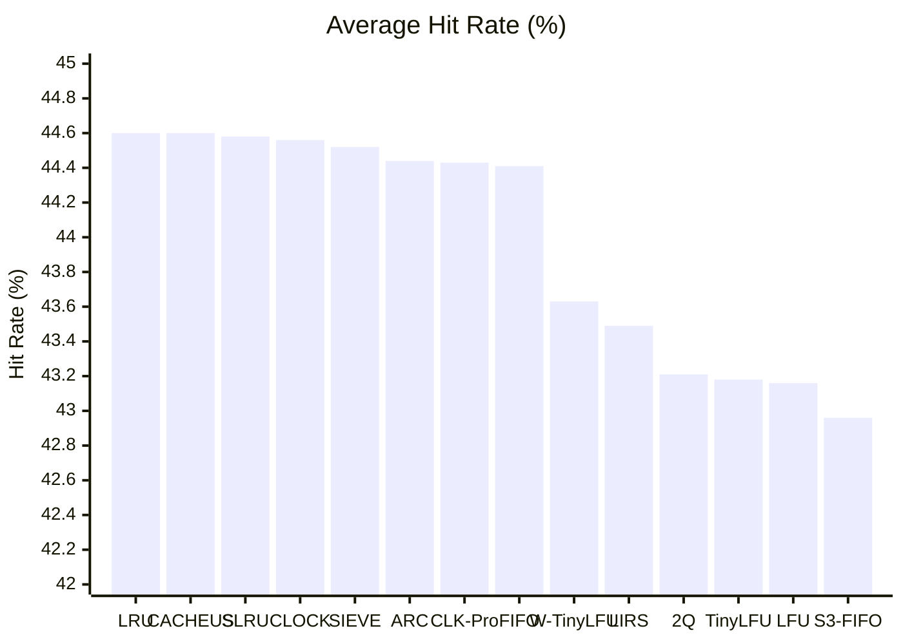

## 실험 개요

본 벤치마크는 14개 캐시 알고리즘을 26개 시나리오에서 비교해, 히트율과 실행 시간의 실제 차이를 확인하는 데 목적이 있다. 테스트 환경은 `C (gcc -O3)`와 `Java (JVM)` 구현 비교이며, 캐시 크기는 `10,000`, 주요 측정 항목은 `히트율(%)`과 `실행 시간(ms)`이다.  
(출처: [벤치마크 결과 (C vs Java)](https://www.notion.so/2f50de9c810b81ecbe99f75cc8ec8560))

| 항목 | 값 |
| --- | --- |
| 알고리즘 수 | 14 |
| 시나리오 수 | 26 |
| 캐시 크기 | 10,000 |
| 구현 환경 | C (gcc -O3), Java (JVM) |
| 측정 지표 | 히트율(%), 실행 시간(ms) |

## 핵심 결과

| 지표 | C | Java | 해석 |
| --- | --- | --- | --- |
| 총 실행 시간 | 6.53초 | 10.28초 | 전반적으로 C가 더 빠르다. |
| 평균 히트율 | 44.0% | 44.0% | 언어 차이보다 알고리즘과 워크로드 영향이 크다. |
| 승리 알고리즘 수 | 13개 | 1개 (CLOCK) | Java는 CLOCK에서만 뚜렷한 우위를 보인다. |

> CLOCK만 Java에서 약 2배 빠르게 측정되었고, 이는 JIT 최적화와 순환 포인터 패턴의 특성 때문으로 추정된다.  
> (출처: [벤치마크 결과 (C vs Java)](https://www.notion.so/2f50de9c810b81ecbe99f75cc8ec8560))

## 실행 시간 비교

```mermaid
xychart-beta
    title "Execution Time (ms) - C vs Java"
    x-axis [CLK-Pro, S3-FIFO, FIFO, LRU, SIEVE, ARC, SLRU, 2Q, LIRS, TinyLFU, W-TinyLFU, LFU, CLOCK]
    y-axis "ms" 0 --> 15
    bar "C" [1.9, 2.1, 2.4, 2.6, 2.6, 2.8, 2.8, 2.9, 3.1, 4.1, 4.2, 6.6, 8.1]
    bar "Java" [4.9, 4.8, 4.3, 5.6, 4.2, 7.0, 5.1, 6.4, 5.6, 6.7, 6.9, 14.4, 4.3]
```

## 히트율 비교

평균 히트율은 `42.96% ~ 44.60%` 범위에 몰려 있다. 즉, 상위권과 하위권의 차이도 `1.64%p` 수준에 불과하다. 이 결과는 알고리즘의 이론적 우월성이 평균 워크로드에서는 쉽게 압축된다는 점을 시사한다.  
(출처: [벤치마크 결과 (C vs Java)](https://www.notion.so/2f50de9c810b81ecbe99f75cc8ec8560))

## 알고리즘별 해석

| 알고리즘 | 관찰 | 해석 |
| --- | --- | --- |
| LRU | 최고 히트율 그룹 | 여전히 범용 기준점 역할을 한다. |
| CLOCK | Java에서만 매우 빠름 | 런타임 최적화 효과가 크게 작용한다. |
| SIEVE | 히트율은 비슷, 실행 시간 우수 | 멀티스레드 환경에서 실전 가치가 높다. |
| CLK-Pro | 매우 빠른 실행 시간 | 효율성 관점에서 강한 후보이다. |
| CACHEUS | 히트율은 높지만 지나치게 느림 | 실전 적용 시 오버헤드 부담이 크다. |

## 시나리오별 차이

실험은 평균 결과만으로 해석하면 놓치는 부분이 있다. 워크로드 유형에 따라 캐시 정책의 강점이 드러나는 구간이 다르다.  
(출처: [벤치마크 결과 (C vs Java)](https://www.notion.so/2f50de9c810b81ecbe99f75cc8ec8560))

| 시나리오 | 관찰 | 의미 |
| --- | --- | --- |
| Zipf α=1.5 | 약 95.7% 히트율 | 상위 인기 데이터가 거의 모든 요청을 차지한다. |
| Frequency Gradual | 약 99.8% 히트율 | 대부분의 정책이 충분히 잘 동작한다. |
| Scan/Loop | 0% | 캐시가 개입해도 이득이 거의 없다. |
| Churn | 14% ~ 31% | 정책 차이가 실제로 드러나는 대표 구간이다. |

## 중간 결론

이 벤치마크는 "최고의 알고리즘 하나"를 선정하기보다, 워크로드와 실행 환경에 따라 선택 기준이 달라져야 한다는 점을 보여준다. 평균 히트율만 보면 차이가 작지만, 실행 시간과 특정 시나리오 민감도를 함께 보면 선택 기준이 더 선명해진다.

## Sources

- [벤치마크 결과 (C vs Java)](https://www.notion.so/2f50de9c810b81ecbe99f75cc8ec8560)
- [Cache](https://www.notion.so/2f40de9c810b8089847ff5ae50395958)
